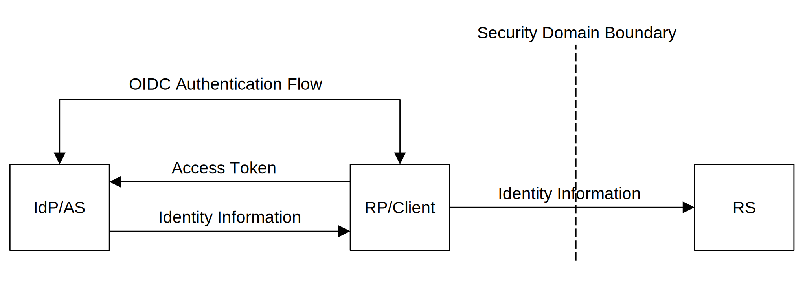

<!-- @import "style.less" -->

# Global Reference Identity Protocol

## Abstract

Global Reference Identity Protocol (GRIP) is an OAuth 2.0-based security protocol that authenticates service requests between untrusted hosts across the internet.

## Introduction

With the growing popularity of protocols based on the OAuth 2.0 specification, there is a need for an interoperable standard that specifies how to convey information about the user from an Identity Provider (IdP) to a resource server (RS) across security domain boundaries.

## Motivation

To enhance SMTP, FTP, and AS2 protocols with a cross-domain authentication mechanism. Also, consider using this mechanism for other communication technologies, e.g., RESTful, WSS, and WebTransport.

## Identity Propagation

In most security concepts and mechanisms, the user's security context propagation stops at the IdP/Relying Party (RP) security domain boundaries. In end-to-end identity propagation, the user's security context is extended to the RS across security domain boundaries, as illustrated in Figure&nbsp;1.

Fig.&nbsp;1.&emsp;3-Legged End-to-End Identity Propagation Model

The user authenticates at the IdP using an authorization code flow. After successful authentication, the RP/Client obtains an access token, which exchanges at the Authorization Server (AS), acting in the role of the JSON-based Security Token Service (STS), for assertion in a JSON Web Token (JWT) format that carries information about the Client and user. The Client presents the token to the RS to gain access to a protected resource on behalf of an authenticated user.

## Impersonation and Delegation

The OAuth 2.0 intrinsic delegation mechanism allows clients with the appropriate security token to impersonate the user or being delegated by that user. As a specific form of identity propagation, the [OAuth 2.0 Token Exchange](https://datatracker.ietf.org/doc/html/rfc8693) specification describes impersonation and delegation, where the Client obtains a security token that allows it to act as a user in the case of impersonation or, in the case of delegation, allows it to act on behalf of the user. The output security token may carry the logical name of the target service for which it is constrained.

## Assertions

Assertions are statements from a token producer to a token consumer that contain information about the principal. In the Identity Propagation scenario, the resource server uses the information in the assertion to identify the Client and user to make authorization decisions about their access to resources controlled by that resource server.

## Identities and Certificate-Bound Tokens

In most client-service-to-server-service communication scenarios, three identities are employed: user-identity, client-identity, and server-identity. Mutual TLS/TLS certificates resolve client-identity and server-identity, while tokens resolve user-identity. Mutual TLS during protected resource access also serves as a proof-of-possession of the token mechanism, as stated in [section 4](https://www.rfc-editor.org/rfc/rfc8705#section-4) of the [RFC8705](https://www.rfc-editor.org/rfc/rfc8705) OAuth 2.0 Mutual-TLS Client Authentication and Certificate-Bound Access Tokens specification.

## 2-Legged OAuth 2.0 Identity Propagation

The sequence diagram illustrated in Figure&nbsp;2 shows the 2-legged identity propagation flow without end-user involvement, where the Client requests access to resources stored on the RS on behalf of the impersonated user.

The sequence diagram is self-explanatory.

    

Fig.&nbsp;2.&emsp;2-Legged Identity Propagation flow

## 3-Legged OAuth 2.0 Identity Propagation

The sequence diagram illustrated in Figure&nbsp;3 shows the 3-legged identity propagation flow for the user authenticated at the IdP, where the Client requests access to resources stored on the RS on behalf of the authenticated user.

The sequence diagram is self-explanatory; the OIDC authentication flow is omitted for clarity.

    

Fig.&nbsp;3.&emsp;3-Legged Identity Propagation flow

## Client to Resource Server Authentication

In addition to using [mTLS Certificate-Bound Access Tokens](https://www.rfc-editor.org/rfc/rfc8705#name-mutual-tls-client-certifica), it is recommended to use one of the following means of proving ownership of the client identifier:

1. [DNS TXT](https://github.com/cargomail-org/grip/blob/main/images/3-legged_identity_propagation_flow_dns_txt.svg)
2. [WebFinger](https://github.com/cargomail-org/grip/blob/main/images/3-legged_identity_propagation_flow_webfinger.svg)
3. [DANE—(DANCE WG)](https://github.com/cargomail-org/grip/blob/main/images/3-legged_identity_propagation_flow_dane.svg)

## Resource Server Discovery

The resource server is usually accessed using a service-specific protocol such as email, instant messaging, etc. These protocols need to connect to a specific port in addition to connecting with a specific server.

DNS SRV record defines a symbolic name, the transport protocol, and the port and hostname to connect to for accessing the service. Therefore, DNS SRV records are the recommended way to enable the discovery of service-specific resource servers.

## Usability Considerations

The primary benefit of Identity Propagation and Assertions in the form of the constrained delegation concept is that it addresses the zero-trust between unrelated security domains. Using an OAuth 2.0 technology is an effective option to secure service-to-service communication. From an OAuth 2.0 perspective, the outbound service is an OAuth 2.0 client, and the inbound service is an OAuth 2.0 resource server.

## Conclusion

The [GRIP-enhanced SMTP and FTP services](https://github.com/cargomail-org/grip/tree/main/poc) stand as proof of concept of the Global Reference Identity Protocol security mechanism.

## Acknowledgment

[NIST Special Publication 800-63C](https://pages.nist.gov/800-63-3/sp800-63c.html), Digital Identity Guidelines: Federation and Assertions, has proven to be an abstract framework for the Global Reference Identity Protocol concept.
