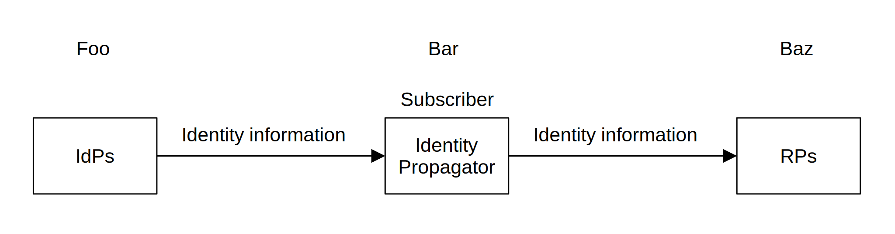

# Identity Propagation Trust Framework

## Introduction

&emsp;With the growing popularity of protocols based on the OAuth 2.0 specification, there is a need for an interoperable standard that specifies how to convey information about the user from an identity provider (IdP) to a relying party (RP) across security domain boundaries. The problem is that designing such a system is challenging because OAuth 2.0 and OIDC are single-authority protocols.

&emsp;We introduce a multi-authority, NIST SP 800-63C conformant, trust framework that propagates identity information from an IdP to an RP when each party, the IdP, the Identity Propagator, and the RP falls under the governance of its respective administrative authority.

## Federation

&emsp;The Identity Propagation Trust Framework uses a multiparty federation protocol, as illustrated in Figure&nbsp;1.

Fig.&nbsp;1.&emsp;Multiparty federation protocol

## Sequence Diagram

