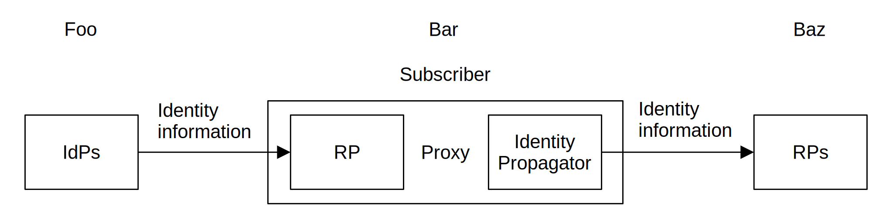
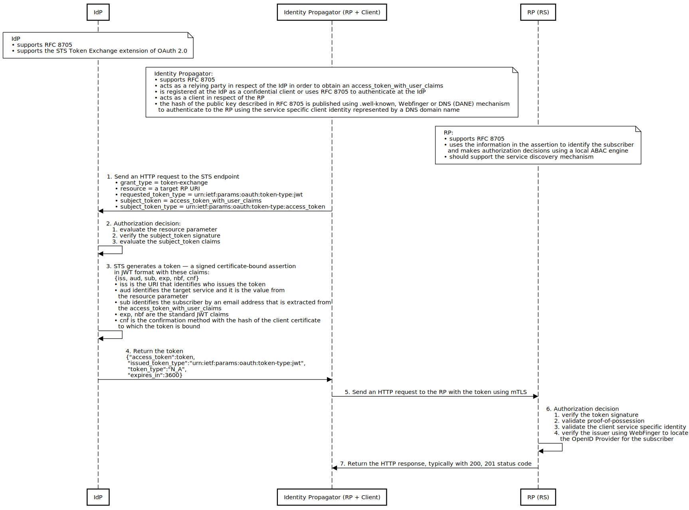

# Identity Propagation Trust Framework

## Introduction

&emsp;With the growing popularity of protocols based on the OAuth 2.0 specification, there is a need for an interoperable standard that specifies how to convey information about the user from an identity provider (IdP) to a relying party (RP) across security domain boundaries. The problem is that designing such a system is challenging because OAuth 2.0 and OIDC are single-authority protocols.

&emsp;We introduce a multi-authority, [NIST SP 800-63C](https://pages.nist.gov/800-63-3/sp800-63c.html) conformant, trust framework that propagates identity information from an IdP to an RP when the IdP, and the RP are not a single entity or are not under common administration.

## Federation

&emsp;The Identity Propagation Trust Framework uses a proxied federation protocol, as illustrated in Figure&nbsp;1. Communication between the IdP and the RP is intermediated through the Identity Propagation Proxy (IdPP) authorized by a Subscriber. Where proxies are used, they function as an RP on one side and an Identity Propagator on the other. The RP and Identity Propagator pair acts as a transparent federation proxy.

Fig.&nbsp;1.&emsp;Proxied Federation

&emsp;Federation allows a given IdP to provide identity information to a number of separately-administered RPs. Similarly, RPs may use more than one IdP.

## Sequence Diagram

Fig.&nbsp;2.&emsp;Sequence Diagram – Identity Propagation Flow

