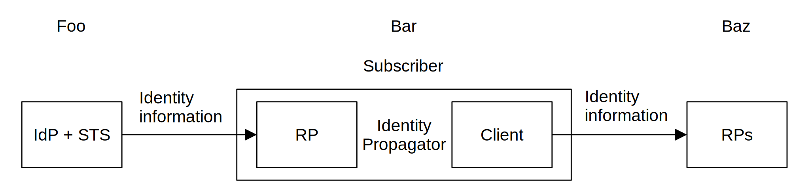

<!-- @import "style.less" -->

# Identity Propagation and Assertions

## Introduction

With the growing popularity of protocols based on the OAuth 2.0 specification, there is a need for an interoperable standard that specifies how to convey information about the user from an identity provider (IdP) to a resource server (RS) across security domain boundaries.

## Motivation

To allow an IdP to provide authentication attributes to a number of separately-administered RSs as illustrated in Figure&nbsp;1

Fig.&nbsp;1.&emsp;Identity Propagation Model

## Sequence Diagram

The sequence diagram illustrated in Figure&nbsp;2 shows an identity propagation flow for the subscriber authenticated to the IdP to be able to access the resources stored on the RS. The following are prerequisites for the given scenario:

TBD

    

Fig.&nbsp;2.&emsp;Identity Propagation Flow

## Usability Considerations

The primary benefit of the identity propagation system is to address the problem of trust between the identity provider, the API provider, and the API consumer.

#### API Provider's Benefits

To identify the third-party clients and users, use composite tokens generated by the identity propagation system instead of the API keys, user IDs, and passwords.

#### API Consumer's Benefits

TBD
