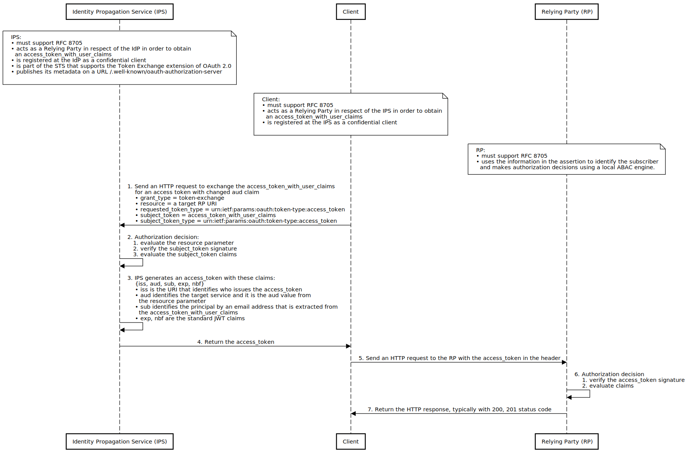

# Identity Propagation Service

## Introduction

&emsp;With the growing popularity of protocols based on the OAuth 2.0 specification, there is a need for an interoperable standard that specifies how to convey information about the user from an identity provider (IdP) to a relying party (RP) across security domain boundaries. The problem is that designing such a system is challenging because OAuth 2.0 and OIDC are single-authority protocols.

## Motivation

&emsp;To allow an IdP to provide authentication attributes to a number of separately-administered RPs. 

## Sequence Diagram

&emsp;The sequence diagram illustrated in Figure&nbsp;1 shows an identity propagation flow for the user authenticated to the IdP to be able to access the resources stored on the RP. The following are prerequisites for the given scenario:

TBD

Fig.&nbsp;1.&emsp;Sequence Diagram – Identity Propagation Flow

